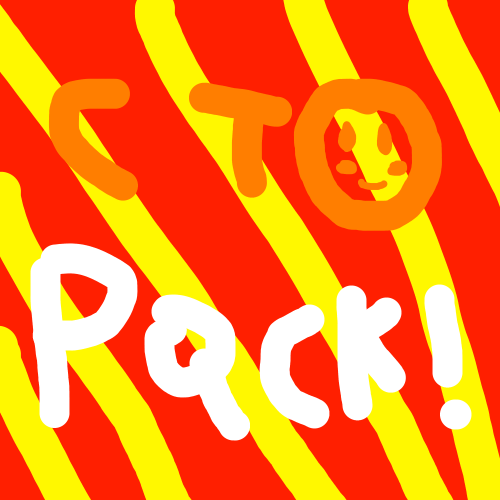
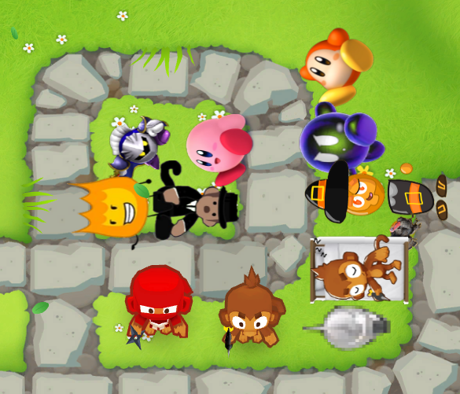

<h1 align="center">Cam's Pack!</h1>

Credit:
Nintendo (The Kirby characters), [jacknjellify](https://www.youtube.com/@BFDI) (Firey), [u/PawaMV](https://www.reddit.com/user/PawaMV/) (The Dark Monkey Idea not the paragon), [MaxLevelIdot](https://www.youtube.com/@MaxLevelIdotisbad) (MaxLevelIdot)

I made everything else

(NOTICE: This mod may be split into differnt mods again, and the github will be archived soon, so watch out for that!)
This mod is pretty old so don't expect it to be good or balanced.

Everything I made in a pack!
Features:
New Towers,
New Paths, 
New Bloons, and
New Gamemodes 
(DM on discord if there's any problems with this mod Discord: camthekirby)

Credit: Nintendo (The Kirby characters), jacknjellify (Firey), u/PawaMV (The Dark Monkey Idea not the paragon), MaxLevelIdot (MaxLevelIdot)

I made everything else

QNA:

Q: did you make this for/work for [insert youtuber]

A: no I make these for fun but it's good to see youtubers covering my mod

Q: Can you add [tower idea]

A: Maybe it depends on the idea

Q: Why are there so many 2D towers and why are the towers blurry

A: I don't know how to code in models or make them and they're blurry because I have to shrink them so the towers aren't big this might be changed in the future

Q: You didn't make [insert tower] idea

A: I did. I would have credited it if not

The Towers:

(Requires Paths Plus Plus https://github.com/doombubbles/paths-plus-plus) All my mods are in one pack!

